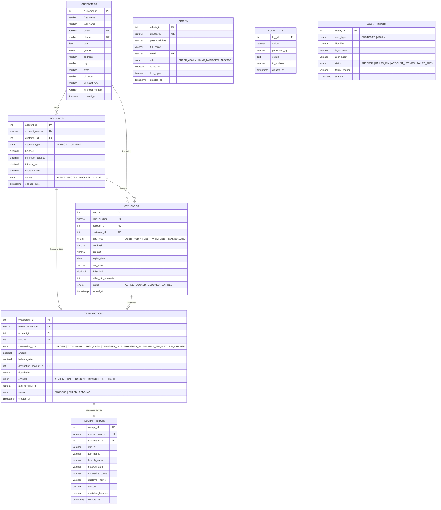

# Entity-Relationship (ER) Diagram - Apex ATM Banking System

This document outlines the Relational Database Architecture for the MySQL database `apex_bank_db`.

```mermaid
erDiagram
    CUSTOMERS ||--o{ ACCOUNTS : "owns"
    CUSTOMERS ||--o{ ATM_CARDS : "issued to"
    ACCOUNTS ||--o{ ATM_CARDS : "linked to"
    ACCOUNTS ||--o{ TRANSACTIONS : "ledger entries"
    ATM_CARDS ||--o{ TRANSACTIONS : "authorizes"
    TRANSACTIONS ||--o| RECEIPT_HISTORY : "generates advice"

    CUSTOMERS {
        int customer_id PK
        varchar first_name
        varchar last_name
        varchar email UK
        varchar phone UK
        date dob
        enum gender
        varchar address
        varchar city
        varchar state
        varchar pincode
        varchar id_proof_type
        varchar id_proof_number
        timestamp created_at
    }

    ACCOUNTS {
        int account_id PK
        varchar account_number UK
        int customer_id FK
        enum account_type "SAVINGS | CURRENT"
        decimal balance
        decimal minimum_balance
        decimal interest_rate
        decimal overdraft_limit
        enum status "ACTIVE | FROZEN | BLOCKED | CLOSED"
        timestamp opened_date
    }

    ATM_CARDS {
        int card_id PK
        varchar card_number UK
        int account_id FK
        int customer_id FK
        enum card_type "DEBIT_RUPAY | DEBIT_VISA | DEBIT_MASTERCARD"
        varchar pin_hash
        varchar pin_salt
        date expiry_date
        varchar cvv_hash
        decimal daily_limit
        int failed_pin_attempts
        enum status "ACTIVE | LOCKED | BLOCKED | EXPIRED"
        timestamp issued_at
    }

    TRANSACTIONS {
        int transaction_id PK
        varchar reference_number UK
        int account_id FK
        int card_id FK
        enum transaction_type "DEPOSIT | WITHDRAWAL | FAST_CASH | TRANSFER_OUT | TRANSFER_IN | BALANCE_ENQUIRY | PIN_CHANGE"
        decimal amount
        decimal balance_after
        int destination_account_id FK
        varchar description
        enum channel "ATM | INTERNET_BANKING | BRANCH | FAST_CASH"
        varchar atm_terminal_id
        enum status "SUCCESS | FAILED | PENDING"
        timestamp created_at
    }

    ADMINS {
        int admin_id PK
        varchar username UK
        varchar password_hash
        varchar full_name
        varchar email UK
        enum role "SUPER_ADMIN | BANK_MANAGER | AUDITOR"
        boolean is_active
        timestamp last_login
        timestamp created_at
    }

    RECEIPT_HISTORY {
        int receipt_id PK
        varchar receipt_number UK
        int transaction_id FK
        varchar atm_id
        varchar terminal_id
        varchar branch_name
        varchar masked_card
        varchar masked_account
        varchar customer_name
        decimal amount
        decimal available_balance
        timestamp created_at
    }

    AUDIT_LOGS {
        int log_id PK
        varchar action
        varchar performed_by
        text details
        varchar ip_address
        timestamp created_at
    }

    LOGIN_HISTORY {
        int history_id PK
        enum user_type "CUSTOMER | ADMIN"
        varchar identifier
        varchar ip_address
        varchar user_agent
        enum status "SUCCESS | FAILED_PIN | ACCOUNT_LOCKED | FAILED_AUTH"
        varchar failure_reason
        timestamp timestamp
    }
```
